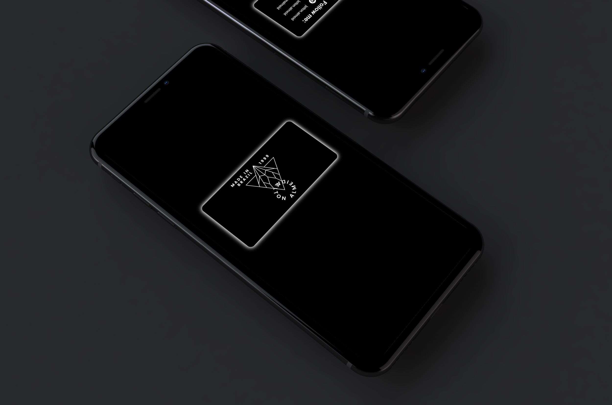

<h1>Cartão de Visita</h1>

  

<h2 align="center">
  Acesse o Cartão de Visita Clicando <a target="_blank" href="https://eltonalmeid.github.io/cartaoDeVisita/">AQUI</a>! :stuck_out_tongue_closed_eyes:
</h2>

   Projeto desenvolvido com ensinamentos do curso ProgramadorBR

  <a href="#clipboard-sobre-o-projeto">Sobre o Projeto</a>&nbsp;&nbsp;&nbsp;|&nbsp;&nbsp;&nbsp;
  <a href="#computer-tecnologias-utilizadas">Tecnologias</a>

## :clipboard: Sobre o Projeto
Cartão de visita com rotação de 180 graus, podendo visualizar a frente e o verso do cartão.
Na parte de trás é possível acessar as redes sociais clicando nos ícones, nos nomes de usuários, ou também através do QR Code utilizando um smartphone, ou tablet.

## :computer: Tecnologias utilizadas

O projeto foi desenvolvido utilizando as seguintes tecnologias:

- HTML
- CSS
- JavaScript
